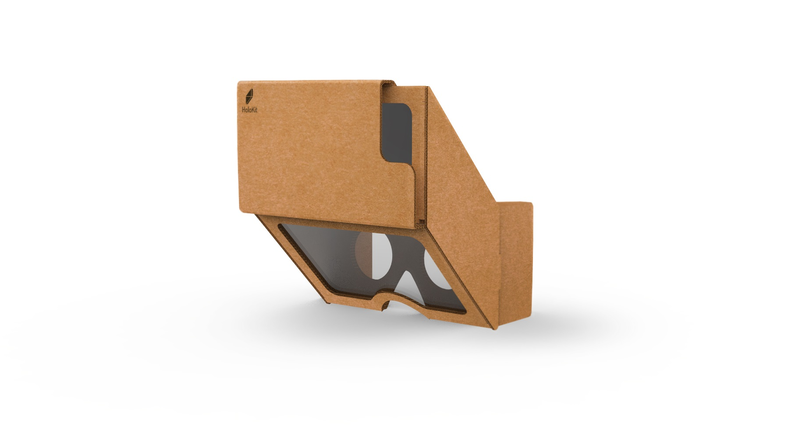
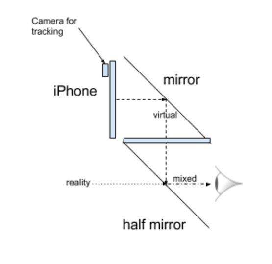
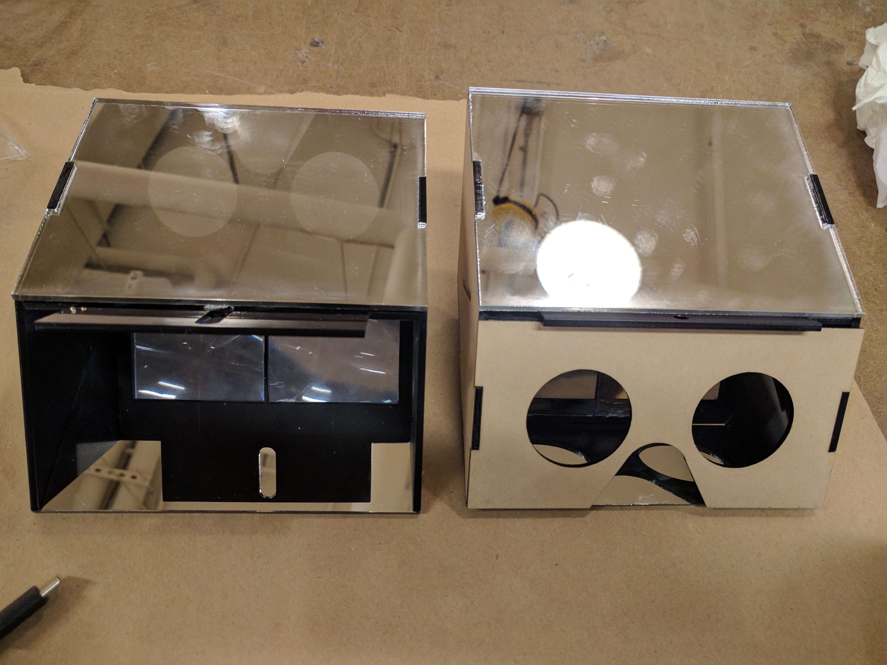

# Welcome to Holokit!

## Overview
Holokit, as you've seen in the news or our website, is an Open-Source project which can turn your mobile phone into a Mixed Reality Device in a low cost and DIY way. It included two parts: Headkit and Trackkit. The HeadKit is the cardboard look like components which you can DIY yourself or order from our website, the Trackkit is the software which will suppport your experience with inside-out tracking and simple environment detection(like find a plane and put a holo-cat on it). In this repo we will provide the instructions of DIY all the components. If you don't want to DIY and just want to order a completed kit, please visit the [Holokit.io](Holokit.io) for more information. 

## Principle
+ For the optical structure, everything is straighforward easy, actually just an optical illusion based on pepper's ghost, and it is actually the principle of the Hololens and Meta

+ For the 3D imaging effects, we are using the stereoscopy, which is actually used by all the popular VR headsets. For further information, please go to this [Wiki](https://en.wikipedia.org/wiki/Stereoscopy) for a better understanding
+ For the inside-out tracking and environment detection, we are using another Open Source projects which have a paper in ISMAR 2017 this year. For more information, please visit [HKUST Aerial Robotics Group](http://uav.ust.hk/). In future, our TrackKit might also possible to support the ARKit.

## Notificaion
+ Right now we provide the Arcylic version of how-to, the cardboard-version needs some optimazation and will open-source soon as well
+ For the DIY amateurs, we highly recommand you to start from Arcylic version rather than from the cardboard one. Unlike the Google Cardboard, the optic structure of Holokit is under high risk influence based on cardboard's strength. 

+ For arcylic version, the performance, including the FOV and optical performance will not equal to the cardboard version. If you want to make a third-party evaluation, please use the cardboard version as a standard.